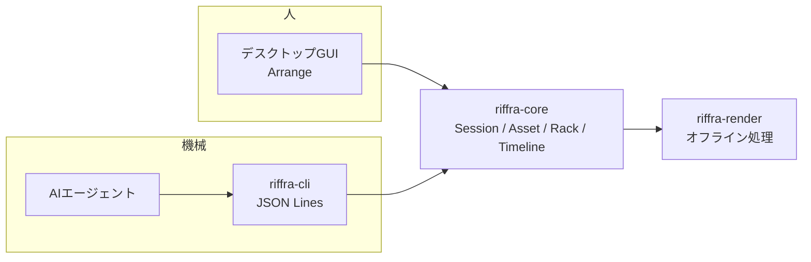
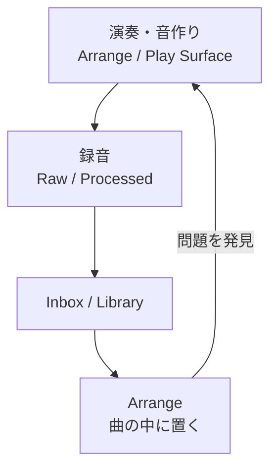

# Riffra 製品構想

## 1. 製品の定義

Riffraは、**練習から曲までを一つの作業空間で繋ぐ**、音楽制作ワークベンチである。楽器や声を入力して音を作り、その音を録音・素材として残し、時間軸上で音楽として組み立てる。どの段階でも、音を作った瞬間の設定と文脈（機器、ラック、録音条件、由来）が失われないことを最優先にする。

デスクトップGUIに加え、AIエージェントが操作できるヘッドレスCLIを、同じセッションと素材の上に構築する。

| 価値                   | 意味                                                                 | 体験として現れる場面                                 |
| ---------------------- | -------------------------------------------------------------------- | ---------------------------------------------------- |
| 準備なしに音を出せる   | 起動するだけで、入力ルーティング済みのアーム済みトラックから音が出る | プロジェクト作成もトラック設定も求められない         |
| 音の文脈が残る         | 原音（Raw）と加工音（Processed）を録音条件と一緒に保存する           | どの機器で、どのラックを通して、いつ録ったかを辿れる |
| 練習がそのまま曲になる | 録音はInboxと時間軸へ直接残る                                        | 切り出して曲の中で組み替えるだけ                     |
| AIにも使わせられる     | ヘッドレスCLIから同じ制作基盤を操作できる                            | AIエージェントが編集・レンダリングを自動化できる     |

対象とする入力はギターに限定しない。歌声、ベース、マイク収録した楽器、外部シンセサイザー、MIDI演奏、既存の音声ファイルも、同じ制作循環へ取り込む。

## 2. 制作領域

制作画面は **Arrange** の単一領域で構成する。演奏から曲作りまで、工程順を固定せず、素材を保ったまま一つの画面で進められる。

| 領域    | 目的                           | 中心となる対象                         | 主な成果                                 |
| ------- | ------------------------------ | -------------------------------------- | ---------------------------------------- |
| Arrange | 演奏しながら音を決め、曲にする | Track、Input、Rack、Plugin、Instrument | 録音、音色、ラック、スナップショット、曲 |

演奏、監視、録音はArrangeの機能であり、Focused Instrument Trackを対象に下部のPlay Surfaceで演奏できる。

### 2.1 Arrange

Arrangeは、入力された音を聞きながら音を作り、録音し、時間軸上で音楽として組み立てる場所である。

| 機能群     | 内容                                                                                    |
| ---------- | --------------------------------------------------------------------------------------- |
| 演奏と監視 | トラック単位の入力・出力選択、低遅延監視、タイピングキーボード／ドラムパッド            |
| 音作り     | トラックラック、VST3の検索・読込み・画面表示・音声処理、バイパス・ミュート・音量・パン  |
| 録音と素材 | 原音と加工音の同時録音、Take管理、スナップショットによる比較・保存                      |
| 構成       | Audio / MIDI Clip、トラック、タイムライン編集、テンポ・拍子・マーカー・ループ・自動変化 |
| 書出し     | マスター、トラック、ステム、MIDI                                                        |

#### Play Surface

Play Surfaceは、Timelineを見ながら選択中のInstrument Trackを演奏するArrangeの下部パネルである。Keyboard／Drum Pads、Octave、Velocity、Computer Keyboard入力を提供し、Record Armは自動変更しない。

- FocusとObject Selectionを分離し、MIDI Clipを選択しても演奏先を維持する
- Armedかつ録音中のFocused Trackだけへ演奏MIDIを記録する
- TimelineとMIDI Editorを同じLower Panelで切り替える

## 3. 二つの利用の形

Riffraは、同じセッションと素材の上に、人と機械の二つの入り口を持つ。

| 利用の形        | 操作者                     | 用途                                                             |
| --------------- | -------------------------- | ---------------------------------------------------------------- |
| デスクトップGUI | 演奏者、制作する人         | 演奏、監視、録音、編集、曲作り（Arrange）                        |
| ヘッドレスCLI   | スクリプト、AIエージェント | プロジェクト操作、トラック・クリップ編集、MIDI配置、レンダリング |

CLIはGUIの操作を模したものではなく、同じriffra-coreのドメインモデルを直接操作する。AIエージェントはriffra-cliをサブプロセスとして起動し、標準入出力のJSON Linesで対話する。オフラインレンダリングを基盤に、ライブ音声を必要としない作業（編集、書出し）を自動化できる。



- ヘッドレス環境は外部VST3とプラグインエディタに依存せず、内蔵音源エンジンとMIDI・オーディオクリップで完結する
- 状態を保持したまま連続操作でき、1コマンドで終わるワンショット実行にも対応する
- 構想の詳細は docs/headless-linux.md に記載する

## 4. 制作の循環と基盤

素材は、同じセッション、素材、履歴を共有しながら、以下の循環を回る。



| 入り口     | 流れ                                                                             |
| ---------- | -------------------------------------------------------------------------------- |
| 演奏から   | 音を作る → 録音 → 切り出し → 曲の中に置く                                        |
| 素材から   | 音声ファイルを取り込む → 波形を切り、整える → クリップとして曲に置く             |
| 曲から音へ | 問題を見つける → Play Surfaceで弾き直す、またはクリップを編集し直す → 差し替える |

### 3.1 共有する制作基盤

すべての機能は同じセッション、素材、履歴を共有する。

| 概念            | 意味                                                               |
| --------------- | ------------------------------------------------------------------ |
| Scratch Session | 起動直後から使える作業空間。プロジェクト作成前の着想も自動保存する |
| Project         | セッション、素材参照、時間軸、音色、設定、履歴をまとめた保存単位   |
| Asset           | 録音、音声、音色、ラック、MIDI、書出し結果などの再利用可能な素材   |
| Library         | 素材を種類にかかわらず検索し、由来と関連を辿る索引                 |
| Inbox           | 未整理の録音、取込みなどを失わず受け止める領域                     |
| Rack            | トラック単位で入力から出力までの音声処理を並べた経路               |
| Recording       | 原音、加工音、MIDI、録音条件をまとめた記録                         |
| Take Group      | 同じ意図で録音した複数候補のまとまり                               |
| Clip            | 素材を変更せず、使用範囲と配置を示す時間軸上の参照                 |
| Snapshot        | ラックや音色の状態を保存し、比較できる候補                         |
| Job             | 走査など、音声入出力を止めずに行う時間のかかる処理                 |

### 3.2 素材の由来

素材は原本を上書きせず、元の素材との関係を保持する。

```text
録音した原音
  ├─ 加工した録音
  ├─ 切り出したクリップ
  └─ 曲へ配置したクリップ
```

各素材には、元の素材、使用したラック、音色、処理内容、作成日時、使用先を辿れる情報を残す。

### 3.3 履歴と再利用

| 約束               | 内容                                                   |
| ------------------ | ------------------------------------------------------ |
| 取り消しとやり直し | 操作は可能な範囲で取り消し、やり直しできる             |
| 比較しても失わない | 音色や素材の候補を比較しても、比較前の状態を失わない   |
| 名前がなくても残る | 良い結果は名前を決める前でもInboxへ残す                |
| 障害時も開ける     | ファイルが移動または消失しても、残りの制作内容を開ける |
| プラグイン不在でも | 無効な置き場所または書出し音声で制作意図を残す         |

## 5. 画面構成

制作画面は、Global Bar、Browser、Main Workspace、Inspector、Transportで構成する。

```text
┌──────────────────────────── Global Bar ─────────────────────────────┐
│ Session ▾  ● Saved   ↶ ↷               Audio ●  ■ │
├──────────────┬────────────────────────────────────┬─────────────────┤
│   Browser    │          Main Workspace            │    Inspector    │
├──────────────┴────────────────────────────────────┴─────────────────┤
│                         Transport                                   │
└─────────────────────────────────────────────────────────────────────┘
```

| 画面部分   | 役割                                                   |
| ---------- | ------------------------------------------------------ |
| Global Bar | セッション名、保存状態、音声状態、安全操作、検索、設定 |
| Browser    | 素材とプラグインを探し、制作領域へ投入する             |
| Inspector  | 選択した対象の詳細と編集項目を表示する                 |
| Transport  | 再生、停止、録音、位置、テンポ、ループを操作する       |

選択、ドラッグ、試聴、取り消し、エラー表示の意味は、制作領域が変わっても統一する。

### 4.1 音声設定の位置

音声設定は、触る頻度と対象で二層に分ける。

| 層               | 内容                                                  | 場所                                  |
| ---------------- | ----------------------------------------------------- | ------------------------------------- |
| デバイス設定     | Driver、Sample Rate、Buffer、入出力機器、プローブ診断 | Global BarのAudio状態から開くSettings |
| 音楽上の入力選択 | どの入力チャンネルをどのトラックで使うか、監視の状態  | トラックヘッダーとインスペクタ        |

設定変更時は安全にMuteし、適用された実効値を表示する。入力選択は演奏中に切り替えられる。

### 4.2 補助機能の位置

| 機能                                                   | 位置                                              |
| ------------------------------------------------------ | ------------------------------------------------- |
| 波形解析・クリップ編集（トリム・スプリット・フェード） | Arrange（タイムライン）                           |
| 録音操作                                               | Arrange（Play Surfaceからも同じ状態で利用できる） |
| Library / Inspector                                    | Arrange 全体で共有する                            |
| 未完成機能                                             | 利用可能な機能と同じ強さで表示しない              |

## 6. 原則と範囲

### 6.1 製品原則

| 原則                     | 意味                                                                                         |
| ------------------------ | -------------------------------------------------------------------------------------------- |
| 音が出ることを最優先する | 画面や設定項目の存在より、入力した音が意図した経路を通り、安全に聞こえることを優先する       |
| 起動したら弾ける         | 起動時にアーム済みのトラックと監視を開き、プロジェクト作成を求めずに演奏と録音を始められる   |
| 原本を壊さない           | 録音や取込み素材を直接上書きせず、編集内容は参照、設定、または新しい素材として保存する       |
| 良い結果を素材として残す | 録音、音色、切出し、分析、書出しを、後から検索して再利用できる状態にする                     |
| 値だけでなく意図を残す   | 数値だけでなく、使用した機器、ラック、音色、元素材、変更理由、使用先を保存する               |
| 失敗を隠さない           | 失敗を成功として扱わず、影響範囲、守られたデータ、利用できる復旧操作を示す                   |
| 中核機能は手元で動く     | 演奏、録音、加工、配置、保存は外部サービスなしで利用できる                                   |
| 複雑さを段階的に見せる   | 基本操作では安全な既定値を使い、必要な利用者だけが詳細な経路、パラメーター、保存情報へ進める |

### 6.2 中核範囲

| 分類        | 内容                                                                                                          |
| ----------- | ------------------------------------------------------------------------------------------------------------- |
| 入力と音声  | デスクトップ上の低遅延な音声入出力、VST3の走査・読込み・画面表示・音声処理・状態保存                          |
| 音作り      | トラック単位のラック編集、音色の比較と保存                                                                    |
| 録音と素材  | 原音と加工音の録音、Take管理、非破壊の波形編集                                                                |
| 時間軸      | 音声とMIDIの配置、時間軸での編集と録音、短い楽曲やスケッチの作成                                              |
| 書出し      | マスター、ステム、MIDI                                                                                        |
| 保存と復旧  | セッション、素材、履歴、復旧情報の保存                                                                        |
| 演奏入力    | タイピングキーボード／ドラムパッドによるMIDI演奏                                                              |
| CLIとAI連携 | ヘッドレスCLIによるプロジェクト・トラック・クリップ操作、MIDI配置、レンダリング、AIエージェントからの連続操作 |

### 6.3 外部DAWへ任せる範囲

Riffraは外部DAWとの競合だけを目的とせず、作った音をWAV、ステム、MIDI、制作情報として安全に渡せるようにする。

- 大規模なトラック構成と複雑な経路設定
- 楽譜制作と映像同期
- 高度なコンピングと編集管理
- 大規模な自動変化の編集
- 専門的なミックスとマスタリング
- 多人数の共同編集

### 6.4 拡張範囲

拡張機能もArrangeと共通の素材・履歴モデルを使い、独立した目的のない画面を増やさない。

- ウェーブテーブル、粒状合成、物理モデルなどの高度な合成方式
- 高度な参照比較と音色探索

## 7. 完成像

四つのシナリオが同じセッション、素材、履歴の上で成立することが、Riffraの製品価値である。

| シナリオ       | 主な手順                                                                                                                       | 成果                                                 |
| -------------- | ------------------------------------------------------------------------------------------------------------------------------ | ---------------------------------------------------- |
| ギター         | 起動 → トラックで入力と監視を確認 → VST3をトラックラックへ → Play Surfaceで弾きながら調整 → Raw / Processed録音 → 時間軸で確認 | アンプを通した音と録音が文脈ごと残り、曲の中で試せる |
| 歌声           | トラックでマイク入力を選ぶ → 処理の順序と量を調整 → 録音 → 良い部分を切り出す → 伴奏と組み合わせる                             | 歌いながら整えた声がそのまま素材になる               |
| 素材から       | 録音・音声ファイルを取り込む → 波形を切り、整え、加工 → クリップとして曲に置く                                                 | 既存の音が再利用できる素材として蓄積される           |
| AIエージェント | CLIでプロジェクト作成 → トラック追加 → MIDIクリップ配置 → レンダリング → 状態取得                                              | 指示だけで曲の骨組みと音声が作られる                 |
