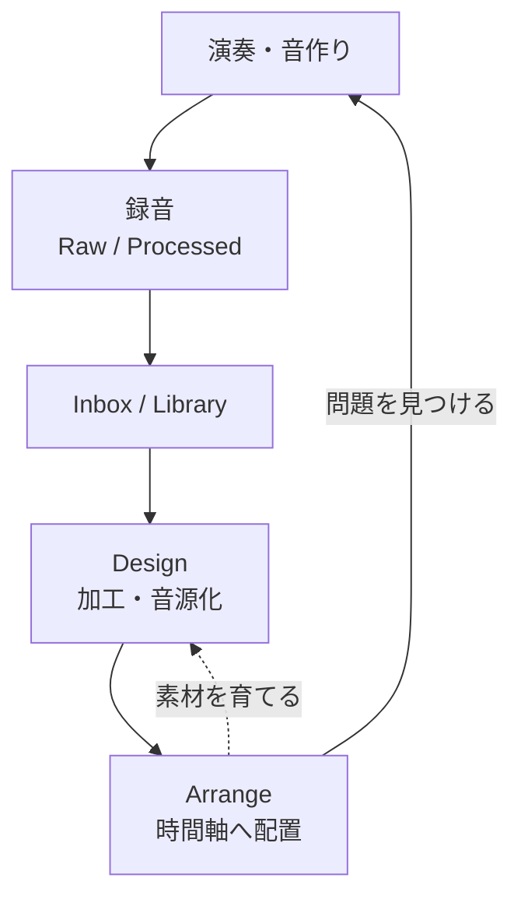

# Riffra 製品構想

Riffraは、演奏から曲作りまでを一つの作業空間でつなぐ音楽制作ワークベンチです。楽器や声から音を作り、録音し、素材として育て、時間軸の上で音楽にします。

Riffraが残すのは完成した音だけではありません。どの機器とラックを使ったか、どの録音から生まれたか、どの加工を経たかを、成果物と一緒に辿れることを重視します。

## 1. 制作体験

Riffraが解決するのは、音を試した瞬間と曲へ置く瞬間の間にある断絶です。音作り、録音、素材の整理、編曲が別々の道具に分かれると、設定や由来が失われ、良い結果を再利用しにくくなります。

Riffraでは、次の価値を一つの制作循環として扱います。

| 価値             | 制作中の体験                                                     |
| ---------------- | ---------------------------------------------------------------- |
| すぐに音を出せる | プロジェクトの準備より先に、入力と監視を確認して演奏を始められる |
| 音の文脈が残る   | 原音、加工音、ラック、機器、録音条件の関係を後から辿れる         |
| 練習が素材になる | 録音した演奏を、そのままクリップや音源の候補として使える         |
| 素材が曲へ戻る   | 作った音を時間軸へ置き、音楽の中で試してから育て直せる           |
| AIからも扱える   | 人が行う制作操作を、CLIから同じ基盤へ依頼できる                  |

入力はギターに限りません。歌声、ベース、マイクで録った楽器、外部シンセサイザー、MIDI演奏、既存の音声ファイル、信号生成で作った音を同じ制作環境へ取り込みます。

## 2. 二つの制作領域

画面は `Arrange` と `Design` の二つの領域で構成します。二つは工程の順番ではなく、役割の違いです。素材を保ったまま何度でも行き来できます。


| 領域    | 役割                                           | 主な成果                                               |
| ------- | ---------------------------------------------- | ------------------------------------------------------ |
| Arrange | 音を聞きながら演奏・録音し、時間軸で組み立てる | 録音、テイク、音声クリップ、MIDIクリップ、曲のスケッチ |
| Design  | 素材や信号の構造を整え、再利用できる音源にする | ワンショット、ループ、音源、音色、派生素材             |

### Arrange

ArrangeはRiffraの主画面です。入力を監視しながら音を決め、録音し、時間軸の上で曲として確かめます。

トラックごとの入出力、低遅延監視、ラック、VST3、音量と定位、Audio/MIDIクリップ、テンポ、拍子、マーカー、ループ、録音を同じセッションで扱います。原音と加工音を分けて残すため、録音後に候補を比較しながら採用できます。

Arrangeには `Play Surface` があります。これは現在フォーカスしているInstrument Trackを鍵盤、ドラムパッド、コンピューターキーボード、外部MIDIから演奏するための領域です。MIDI Editorで編集しているクリップや、画面上で選択している対象とは独立して演奏先を保ちます。

### Design

Designは、音の材料と構造を設計する場所です。録音や音声ファイルを加工する方法と、基本波形、ノイズ、数式、制御値から信号を生成する方法を同じ制作循環で扱います。

| 出発点                     | できること                                     | 成果                           |
| -------------------------- | ---------------------------------------------- | ------------------------------ |
| 録音・音声ファイル・分離音 | 切り出し、フェード、変形、重ね合わせ、割り当て | ワンショット、ループ、音源     |
| 基本波形・ノイズ・数式     | 合成、変調、包絡、フィルター、信号の接続       | 音色、演奏可能な音源、音声素材 |

生成した音は音声素材として加工でき、音声素材は生成器の変調源として利用できます。生成式や処理の構造だけでなく、生成した結果と演奏先の関係も保存し、後から同じ音を試せるようにします。

## 3. 共有する制作基盤

ArrangeとDesignは、別々のファイルや設定を持ちません。両方が同じセッション、素材、由来、履歴を参照します。

| 概念            | 役割                                                                               |
| --------------- | ---------------------------------------------------------------------------------- |
| Scratch Session | 起動直後から使える作業空間。名前や保存先を決める前の着想も受け止める               |
| Project         | セッション、素材の参照、時間軸、設定、履歴をまとめた保存単位                       |
| Asset           | 録音、音声、MIDI、音源、音色、ラック、分析結果、書き出し結果などの再利用可能な素材 |
| Library         | 素材を検索し、由来と利用先を辿るための索引                                         |
| Inbox           | 未整理の録音や取込み結果を失わずに受け止める場所                                   |
| Rack            | 入力から出力までの音声処理を並べた経路                                             |
| Clip            | 素材を変更せず、使用範囲と時間軸上の位置を示す参照                                 |
| Take            | 一つの録音から生まれた候補。原音と加工音を比較できる                               |
| Snapshot        | ラックや音色の状態を保存した比較用の候補                                           |

素材は原本を上書きせず、派生物との関係を残します。

```text
録音した原音
  ├─ 加工した録音
  ├─ 切り出したワンショット
  ├─ 作成したループ
  ├─ 分離した音
  ├─ 鍵盤・パッド用の音源
  └─ 曲へ配置したクリップ
```

良い結果は名前を決める前でも失われません。比較や加工を行っても、元の素材、使用したラック、処理内容、作成日時、利用先を辿れる状態を保ちます。

## 4. 二つの利用の入口

Riffraは、同じ制作基盤に人と機械の入口を用意します。

| 入口            | 主な利用者                 | 役割                                                                       |
| --------------- | -------------------------- | -------------------------------------------------------------------------- |
| デスクトップGUI | 演奏者、制作者             | 演奏、監視、録音、音作り、編集、曲作り                                     |
| ヘッドレスCLI   | スクリプト、AIエージェント | プロジェクト操作、トラック・クリップ編集、MIDI配置、素材処理、レンダリング |

CLIはGUIの画面操作を模倣する別の制作環境ではありません。GUIと同じ `riffra-core` の制作操作を呼び出し、標準入出力のJSON Linesで結果を受け取ります。対話を続けることも、一つの操作だけを実行することもできます。

ライブ音声を必要としない作業は、デスクトップ画面を開かずに自動化できます。外部からの操作であっても、セッションの正準化、素材の不変性、履歴の規則はGUIと共有します。

## 5. 制作の循環

Riffraでは、制作の入口を固定しません。



| 出発点 | 流れ                                                                              |
| ------ | --------------------------------------------------------------------------------- |
| 演奏   | 音を作る → 原音と加工音を録音する → 素材を整える → 曲へ置く                       |
| 数式   | 信号を組み立てる → 演奏しながら調整する → 音色または音源として保存する → 曲へ置く |
| 素材   | 音声やMIDIを取り込む → 切り出し・加工・割り当てを行う → 演奏する → 曲へ置く       |
| 曲     | 問題のある箇所を見つける → 弾き直すか素材を加工する → 置き換えて確かめる          |

## 6. 製品原則

| 原則                   | 判断の基準                                                               |
| ---------------------- | ------------------------------------------------------------------------ |
| 安全に音を出す         | 画面や設定項目より、入力した音が意図した経路を安全に通ることを優先する   |
| 起動したら弾ける       | プロジェクトを作る前でも、演奏と録音を始められる                         |
| 原本を壊さない         | 編集は参照、設定、または新しい素材として保存する                         |
| 良い結果を残す         | 録音、音色、切り出し、分析、書き出しを検索・比較・再利用できるようにする |
| 意図を残す             | 数値だけでなく、機器、ラック、元素材、処理、利用先を記録する             |
| 複雑さを段階的に見せる | 基本操作には安全な既定値を使い、詳細は必要なときに開く                   |
| 中核機能を手元に置く   | 演奏、録音、加工、配置、保存を外部サービスなしで行えるようにする         |

## 7. Riffraが担う範囲

Riffraは、音を試して素材として残し、短い曲やスケッチへ組み立てる制作環境です。大規模な共同編集、映像同期、楽譜制作、複雑なミックスやマスタリングを一つの画面へ集約することは中心の目的にしません。

一方で、作った音を外部の制作環境へ渡せることは重視します。WAV、ステム、MIDI、制作情報を、由来を失わずに書き出せるようにします。
