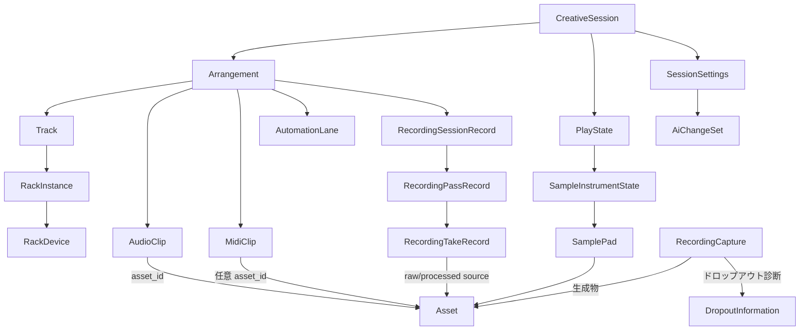

# Riffra データモデル

## 1. スコープ

本書はRiffraのドメインエンティティを正準化し、TypeScript / Rust / C++ の3言語での定義場所と対応関係を示す。3言語で同じエンティティを別々に定義するため、ズレを検知するための単一の参照元として機能する。

### 書くこと

- エンティティのカタログと役割
- 各エンティティの3言語での定義場所（ファイルパス）
- 言語間対応の規則（serde・命名・欠落扱い・不透明データ）
- 守るべき不変条件と制約
- スキーマ進化の方針

### 書かないこと

- 各エンティティのフィールド全件・型の全列挙
- 各フィールドのJSONキー名
- 派生型・内部表現・実装詳細
- 個別のバリデーションロジック

詳細は各言語のコードを真実源とする。層構造の全体像は `architecture.md`、境界の契約は `ipc.md` を参照。

---

## 2. 型定義の場所

| エンティティ群                                  | 正準定義（Rust）                                                         | TypeScript                                          | C++ ミラー                                              |
| ----------------------------------------------- | ------------------------------------------------------------------------ | --------------------------------------------------- | ------------------------------------------------------- |
| セッション / アレンジ / クリップ / 録音レコード | `crates/riffra-core/src/session.rs`                                      | `apps/desktop/src/lib/generated/*.ts`（ts-rs 生成） | `native/audio-engine`（ランタイム投影に必要な部分のみ） |
| 素材（Asset / Provenance）                      | `crates/riffra-core/src/asset.rs`                                        | 同上                                                | —                                                       |
| ラック（RackDevice / Macro）                    | `crates/riffra-core/src/rack.rs`                                         | 同上                                                | `native/audio-engine`（グラフ構築）                     |
| 録音キャプチャ / ドロップアウト                 | `apps/desktop/src-tauri/src/recording/model.rs`                          | 同上                                                | `native/audio-engine`（録音制御）                       |
| 録音の read model                               | `apps/desktop/src-tauri/src/recording/repository.rs`（`RecordingAsset`） | 同上                                                | —                                                       |
| バックグラウンドジョブ                          | `apps/desktop/src-tauri/src/jobs.rs`                                     | 同上                                                | —                                                       |
| オーディオ / デバイス状態                       | `apps/desktop/src-tauri/src/model.rs` ほか                               | 同上                                                | `native/audio-engine`                                   |

TypeScript は `npm run gen:types`（cargo test による ts-rs 出力 → `scripts/gen-barrel.js` のバレル生成）で常に Rust から再生成される。手書きの型は追加しない。

---

## 3. 言語間対応の規則

| 規則               | 内容                                                                                                                                                                  |
| ------------------ | --------------------------------------------------------------------------------------------------------------------------------------------------------------------- |
| serde 直列化       | `rename_all = "camelCase"`（enum は `"lowercase"`、`AiPermission` のみ `"PascalCase"`）                                                                               |
| 不透明 ID 型       | `TimelineTick`・`Marker.tick` などは `#[ts(type = "number")]`。`AssetId` は `string & { readonly __brand: 'AssetId' }`（直列化はプレーン文字列 `<-> asset:<UUIDv7>`） |
| 省略可能フィールド | `skip_serializing_if = "Option::is_none"` + `#[ts(optional)]` を対で使用                                                                                              |
| 型の欠落           | ts-rs で生成できない型（`serde_json::Map` の `parameters` 等）は該当フィールドを `#[ts(skip)]` せず、生成側の扱いに従う                                               |
| C++ ミラー         | セッション全体はコピーしない。投影（グラフ・パラメータ・演奏・録音）に必要なスライスだけを別プロトコルで渡す（`ipc.md` のサイドカー契約）                             |
| 正当性の基準       | 永続化される正準表現は常に Rust の `CreativeSession`。TS は表示・編集のための投影、C++ は実行のための投影                                                             |

---

## 4. エンティティカタログ

### 4.1 セッションと設定

| エンティティ      | 役割                                                                                                                                                   |
| ----------------- | ------------------------------------------------------------------------------------------------------------------------------------------------------ |
| `CreativeSession` | すべての制作状態の単一の正準モデル。session_id（`scratch-<ms>`）、更新トークン updated_at_ms、workspace、design_context、play_state、arrangement、settings を保持 |
| `Workspace`       | `arrange` / `design` の固定二領域。`Sample` / `Analyze` / `Separate` は領域ではなく Design から到達するツール                                          |
| `DesignContext`   | Design 領域が現在対象としているツールと素材（active_tool, target_asset_id）                                                                            |
| `SessionSettings` | マスターゲイン、ループ、カウントイン、メトロノーム、ノート、AI権限・履歴など、構造ではないセッション全体の設定                                         |

### 4.2 アレンジ（時間軸）

| エンティティ                               | 役割                                                                                                                                                                                                  |
| ------------------------------------------ | ----------------------------------------------------------------------------------------------------------------------------------------------------------------------------------------------------- |
| `TimelineTick`                             | 時間軸の基本単位。`TIMELINE_PPQ = 960`：1拍を960分割                                                                                                                                                  |
| `ProjectTimebase`                          | 拍子・テンポ・ppq からなる音楽クロック。ルーラー・スナップ・MIDI・トランスポートが共有                                                                                                                |
| `FrameRange` / `FrameDuration`             | ソース素材のフレーム範囲／持続時間（サンプルレートを併せ持つ）                                                                                                                                        |
| `TimelineLoopRange` / `TimelinePunchRange` | ループ区間（無効化しても端点保持）とパンチ録音区間                                                                                                                                                    |
| `Track`                                    | Audio / Instrument の2種類。ゲイン・パン・ミュート・ソロ・アーム・モニタリング・入力ルート・インストゥルメント・トラックラックを保持                                                                  |
| `AudioClip`                                | 非破壊オーディオクリップ。`asset_id` + `source_range` + `timeline_duration`、ゲイン・パン・フェード・ループ・ミュート。録音テイクへの関連（recording_take_id）と`take_variant`（raw/processed）を持つ |
| `MidiClip`                                 | 非破壊 MIDI クリップ。`MidiNote`（ピアノロール編集対象）と `MidiEvent`（CC/ピッチベンド/チャンネルプレッシャーを忠実保持）を持つ。`asset_id` は任意（セッション内で完結する MIDI は持たない）         |
| `AudioClipPatch` / `MidiClipPatch`         | 部分更新。None のフィールドは現値を維持                                                                                                                                                               |
| `AutomationLane` / `AutomationPoint`       | トラックミックスパラメータ（volume / pan）のタイムライン制御データ                                                                                                                                    |
| `Marker`                                   | ルーラー表示用の名前付き位置情報（音声処理には影響しない）                                                                                                                                            |
| `Arrangement`                              | 上記のすべてを束ねるアレンジのルート。revision（編集のたびに単調増加）、timebase、tracks、clips、automation、markers、録音レコード群を持つ                                                            |

### 4.3 録音

| エンティティ             | 役割                                                                                                                                                                                                                                                    |
| ------------------------ | ------------------------------------------------------------------------------------------------------------------------------------------------------------------------------------------------------------------------------------------------------- |
| `RecordingSessionRecord` | 録音の試行グループ。track_slots（トラックごとのアクティブテイクとタイムラインクリップ）と pass_ids を持つ                                                                                                                                               |
| `RecordingPassRecord`    | 録音範囲を1回通ったパス。ordinal、位置・長さ、部分開始/終了フラグ、そのパスのテイクID列                                                                                                                                                                 |
| `RecordingTakeRecord`    | 1パスが生んだトラック単位の成果物。`raw_audio` / `processed_audio`（`TakeAudioSource`：asset_id + サンプル範囲 + テール + サンプルレート）、`midi_asset_id`。v1 の raw_audio_asset_id 等はインポート時に移行され新規セッションでは書かれない            |
| `AudioTakeVariant`       | `raw` / `processed`。AudioClip がどちらの音源を使うか。片方が欠けていれば `preferred_audio_source` がフォールバック                                                                                                                                     |
| `RecordingCapture`       | 録音イベントそのもの（工程）。状態遷移 `recording → completing → completed \| recoverable \| failed` を唯一の遷移行列で定義。開始時点のセッション文脈（デバイス・マスター・アーム済みトラック）を保存。生成物は Asset ID で参照 |
| `DropoutInformation`     | 録音中のドロップアウト診断（書き込みサンプル数、欠落ブロック、欠落サンプル、ドロップアウト区間。raw/processed 別）                                                                                                                                      |
| `RecordingAsset`         | UI 用 read model。`recordings/inbox` のマニフェストから組み立て、回復（recoverable）時の表示・復旧操作を担う。永続ドメインとしては使用しない                                                                                                            |

ディスク上の構成は `recordings/inbox|archive|library/<take>/`（manifest.json + raw/processed WAV + midi.json）。再生・編集に使うのはキャプチャから登録された正準 Asset であり、テイクディレクトリはリカバリ用の記録に留まる。

### 4.4 素材（Asset）

| エンティティ                         | 役割                                                                                                                                                           |
| ------------------------------------ | -------------------------------------------------------------------------------------------------------------------------------------------------------------- |
| `AssetId`                            | `asset:<UUIDv7>` のみ有効な、プロセス跨ぎで一意なID                                                                                                            |
| `Asset`                              | 正準の制作素材。id、kind、コンテンツの場所（content_location）、作成・更新時刻、provenance、管理メタデータ（tag / note / favorite）                            |
| `AssetKind`                          | `audio` / `midi` / `sample` / `generationDefinition`                                                                                                           |
| `Provenance` / `ProvenanceOperation` | 素材がどう生まれたか。operation（recorded / processed / sampled / separated / rendered / generated / imported）と source_asset_ids（消費した素材）、parameters |
| 生成規則                             | `register`（新規IDを mint）と `derive`（source から派生物を mint）。コンテンツ変更は決して既存IDを上書きしない                                                 |

### 4.5 ラック

| エンティティ   | 役割                                                                                                                                                                                               |
| -------------- | -------------------------------------------------------------------------------------------------------------------------------------------------------------------------------------------------- |
| `RackInstance` | Trackで現在使われている信号チェーン（devices + macros）                                                                                                                                            |
| `RackDevice`   | チェーンの1スロット。`input` / `plugin` / `utility` / `output`。パス、バイパス、ゲイン、パラメータ値、プラグイン状態データ（不透明文字列）、欠落プラグインのプレースホルダ（disabled_placeholder） |
| `RackMacro`    | パラメータに割り当てる名前付きマクロコントロール                                                                                                                                                   |

### 4.6 演奏

| エンティティ                          | 役割                                                                       |
| ------------------------------------- | -------------------------------------------------------------------------- |
| `PlayState` / `SampleInstrumentState` | ライブ演奏の状態（サンプルインストゥルメント構成）                         |
| `SamplePad`                           | パフォーマンス用パッド。素材、再生区間（ms）、MIDIキー割当、ゲイン、ループ |

### 4.7 AI提案

| エンティティ   | 役割                                                                                   |
| -------------- | -------------------------------------------------------------------------------------- |
| `AiPermission` | AI 提案の許可範囲（Explain / Suggest / Apply）                                         |
| `AiChangeSet`  | 反転可能なAI提案レコード。対象・現在値・提案値・理由・予想効果・リスク・適用済みフラグ |

### 4.8 バックグラウンドジョブ

| エンティティ          | 役割                                                                                     |
| --------------------- | ---------------------------------------------------------------------------------------- |
| `JobKind`             | `analysis` / `separation` / `scan`。ジョブの種別は結果ペイロードの型を固定する判別子     |
| `JobState`            | `queued → running → cancelling → cancelled \| completed \| failed`（終端からは戻らない） |
| `BackgroundJobStatus` | IPC 境界の typed view。kind がタグとなり result の形状を決定                             |

---

## 5. エンティティ関係

- 素材（Asset）はセッションの外に正準で存在し、セッションは ID で参照する
- 録音レコード（Session/Pass/Take）はアレンジに永続化され、テイクの音源は Asset を指す
- 録音キャプチャは `recordings/` 配下の一時的な記録であり、完了時に Asset が正準となる

---

## 6. 不変条件と正準化

`validate_and_normalize`（`CreativeSession`）と `normalize_fields`（`AudioClip`）が守る規則。ロードと保存の両方の境界で適用される。

| 対象           | ルール                                                                                                                               |
| -------------- | ------------------------------------------------------------------------------------------------------------------------------------ |
| session_id     | 空文字禁止。新規は `scratch-<ms>`                                                                                                    |
| タイムベース   | `ppq` は常に `960`（`TIMELINE_PPQ`）。`bpm` は有限かつ `20.0..=400.0`。拍子の分母は `1/2/4/8/16/32`、分子は非ゼロ                    |
| ゲイン         | マスター `-90.0..=0.0`、クリップ・トラック・デバイス・パッド・AI提案 `-90.0..=24.0`。非有限値はエラー（マスター）または 0.0 へ正準化 |
| パン           | `-1.0..=1.0`、非有限値は 0.0                                                                                                         |
| フェード       | fade_in / fade_out はタイムライン持続時間以下にクランプ                                                                              |
| カウントイン   | `0..=8` 拍                                                                                                                           |
| AI 文脈        | 既知 ID リストのみ、64文字以下、16件まで、重複除去。履歴は128件まで                                                                  |
| AssetId        | `asset:<UUIDv7>` のみ有効（旧形式・任意文字列は拒否）                                                                                |
| 素材コンテンツ | 不変。内容変更は新しい Asset を mint する。変更可は管理メタデータのみ                                                                |
| 参照整合       | セッションが参照する AssetId は登録済みでなければならない（未登録参照は保存・ロード拒否、`architecture.md §6.4`）                    |
| 録音遷移       | `RecordingCapture` は定義済み遷移行列のみ許可。終端状態からは戻れない                                                                |
| 更新順序       | `updated_at_ms` は単調増加に補正され、UI 境界の順序トークンになる                                                                    |

---

## 7. スキーマ進化の方針

| 方針           | 内容                                                                                                                                                                            |
| -------------- | ------------------------------------------------------------------------------------------------------------------------------------------------------------------------------- |
| 後方互換の是認 | 旧フィールドは「読めるが書かない」。読み込み時に現行形へ移行し、シリアライズ時には旧フィールドを出力しない（例: `raw_audio_asset_id` → `raw_audio` への移行）                   |
| 移行は境界で   | 旧録音テイク形状の変換、テイクのパス再構成、レガシーテイクのサンプルレート補完は `deserialize_session` / ロード境界のみで行い、ドメインは現行形だけを扱う |
| 世代回復の前提 | 読み込めない世代はスキップされるため、新スキーマは常に「旧セッションを読み込める」必要がある（保存は現行形で行う）                                                              |
| 言語間の同期   | 型定義は Rust が唯一の真実源。TS は再生成、C++ は投影プロトコルの検証テスト（`scripts/test-ipc.ps1` ほか）で整合を保つ                                                          |
