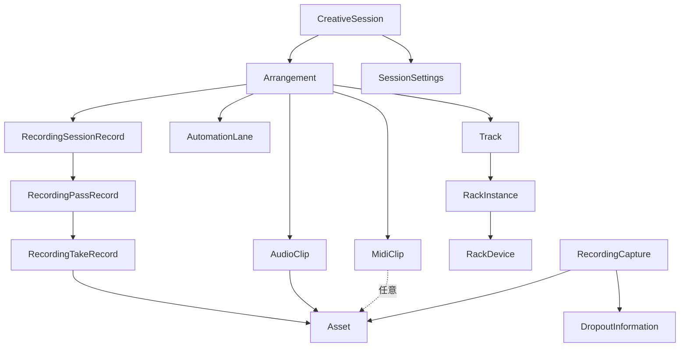

# Riffra データモデル

Riffraの制作状態は、Rustで定義する `CreativeSession` を正本とします。TypeScriptは画面と操作のための投影を、C++は音声実行に必要な投影を受け取ります。各言語が独自のセッションモデルを持たないことで、保存、画面表示、音声実行の意味を揃えます。

アーキテクチャ全体は [アーキテクチャ](architecture.md)、境界のメッセージは [IPC契約](ipc.md) を参照してください。

## 1. 正本と投影

| 用途                          | 定義場所                                | 扱い                                                   |
| ----------------------------- | --------------------------------------- | ------------------------------------------------------ |
| 制作状態とドメイン規則        | `crates/riffra-core/src/domain/`        | 永続化される唯一の正本                                 |
| アプリケーション操作          | `crates/riffra-core/src/application/`   | 正本を検証し、変更を確定する                           |
| TypeScriptの境界型            | `apps/desktop/src/model/generated/`     | Rustの定義から生成する。手書きの複製は置かない         |
| 音声ランタイムの状態          | `native/audio-engine/` と投影プロトコル | セッション全体ではなく、実行に必要な部分だけを受け取る |
| Desktop固有の録音・ジョブ状態 | `apps/desktop/src-tauri/src/`           | Coreの制作状態と区別して扱う                           |

TypeScriptの型は `npm run gen:types` で生成します。画面用の表示状態、音声デバイスの状態、ジョブの進行状態は制作状態の一部ではないため、それぞれの境界で管理します。

## 2. セッションと時間軸

| エンティティ                               | 役割                                                                         |
| ------------------------------------------ | ---------------------------------------------------------------------------- |
| `CreativeSession`                          | 永続化される制作状態のルート                                                 |
| `SessionSettings`                          | マスター音量、ループ、カウントイン、メトロノームなどセッション全体の設定     |
| `Arrangement`                              | 時間軸、トラック、クリップ、オートメーション、マーカー、録音レコードを束ねる |
| `ProjectTimebase`                          | テンポ、拍子、時間軸の分解能を定める音楽上の時計                             |
| `TimelineTick`                             | クリップ、ノート、マーカーの位置を表す時間軸の単位                           |
| `FrameRange` / `FrameDuration`             | 音声素材のサンプル範囲と長さ                                                 |
| `TimelineLoopRange` / `TimelinePunchRange` | 再生ループとパンチ録音の範囲                                                 |

### トラックとクリップ

| エンティティ                         | 役割                                                                                                      |
| ------------------------------------ | --------------------------------------------------------------------------------------------------------- |
| `Track`                              | AudioまたはInstrumentの入力、監視、ミックス、ラック、録音状態を持つ                                       |
| `AudioClip`                          | Assetの一部を時間軸へ参照する非破壊クリップ。範囲、長さ、音量、定位、フェード、ループを持つ               |
| `MidiClip`                           | MIDIノートと演奏イベントを時間軸へ置く非破壊クリップ。Assetを参照する形と、セッション内で完結する形がある |
| `AudioClipPatch` / `MidiClipPatch`   | 既存クリップの一部だけを更新する操作入力                                                                  |
| `AutomationLane` / `AutomationPoint` | トラックの音量や定位などを時間軸に沿って変化させるデータ                                                  |
| `Marker`                             | 時間軸上の位置に名前を付ける情報。音声処理の状態は変更しない                                              |

Audio ClipとMIDI Clipは、素材そのものではありません。どちらもAssetまたはクリップ内の演奏データを、時間軸上の範囲と設定によって参照します。

## 3. 録音

録音は、実行の記録と生成された素材を分けて扱います。

| エンティティ             | 役割                                                                             |
| ------------------------ | -------------------------------------------------------------------------------- |
| `RecordingSessionRecord` | 一つの録音意図に属する複数のパスとトラックの記録                                 |
| `RecordingPassRecord`    | その録音範囲を一度通過した記録。位置、長さ、部分録音の状態、生成したテイクを持つ |
| `RecordingTakeRecord`    | トラック単位で生成された成果物。原音、加工音、MIDI素材への参照を持つ             |
| `AudioTakeVariant`       | Audio Clipが使う `raw` または `processed` の選択                                 |
| `RecordingCapture`       | 録音開始から完了または回復可能な状態までの一時的な工程記録                       |
| `DropoutInformation`     | 録音中に起きた欠落を診断する情報                                                 |
| `RecordingAsset`         | 録音一覧と回復画面で使う読み取り用モデル                                         |

録音の一時ファイルは `recordings/inbox` に置かれ、完了後にAssetとして登録されます。録音レコードはアレンジに残り、音声やMIDIの実体はAssetとして管理します。

## 4. 素材とラック

### Asset

| エンティティ          | 役割                                                                             |
| --------------------- | -------------------------------------------------------------------------------- |
| `AssetId`             | `asset:<UUIDv7>` 形式で素材を一意に識別するID                                    |
| `Asset`               | 種類、コンテンツの場所、作成・更新時刻、由来、タグやメモなどの管理情報を持つ素材 |
| `AssetKind`           | `audio` または `midi`                                                            |
| `Provenance`          | 素材がどの操作から生まれたか、どの素材を消費したかを表す由来                     |
| `ProvenanceOperation` | 録音、加工、レンダリング、取込みなど、素材を生んだ操作の種類                     |

素材のコンテンツは不変です。加工や変換によって内容が変わる場合は新しいAssetを作り、既存Assetにはタグ、メモ、名前などの管理情報だけを書き戻します。

### Rack

| エンティティ   | 役割                                                            |
| -------------- | --------------------------------------------------------------- |
| `RackInstance` | Trackが現在使うデバイスの並びとマクロ                           |
| `RackDevice`   | 入力、Instrument、Effect、Utility、出力など、一つの処理スロット |
| `RackMacro`    | 複数のデバイスパラメーターへ割り当てる名前付き操作              |

プラグインが見つからない場合も、保存されたラックの意図を失わないよう、無効なデバイスとして状態を保持します。音声ランタイムが実行できるのは、保存されたラックから作った一時的な投影です。

## 5. バックグラウンドジョブ

時間のかかる処理は制作状態と分けてジョブとして追跡します。

| エンティティ          | 役割                                                                         |
| --------------------- | ---------------------------------------------------------------------------- |
| `JobKind`             | 結果の種類を識別するタグ                                                     |
| `JobState`            | `queued`、`running`、`cancelling`、`cancelled`、`completed`、`failed` の状態 |
| `BackgroundJobStatus` | IPC境界で進行、結果、失敗を伝える読み取りモデル                              |

ジョブの状態は終端へ向かって進み、完了後に実行中へ戻りません。レンダリングは専用ワーカーが実行し、UIはジョブの状態だけを参照します。

## 6. エンティティの関係

セッションはAssetのIDを参照します。Assetの実体はセッションの外にあり、録音レコードはそのAssetを生成した経緯と、アレンジ上の利用先を結びます。

## 7. 不変条件

Coreはロードと保存の両方で値を検証し、同じ意味を持つ正準表現へ整えます。

| 対象       | 守ること                                                                                 |
| ---------- | ---------------------------------------------------------------------------------------- |
| セッション | IDを持ち、時間軸、トラック、クリップ、設定が定義された範囲に収まる                       |
| 時間軸     | テンポ、拍子、位置、長さが有限値であり、クリップやノートの範囲が矛盾しない               |
| AssetId    | `asset:<UUIDv7>` 形式だけを受け入れる                                                    |
| Asset参照  | セッションが参照するAssetは登録済みである。実体ファイルの欠落は別のMissing状態として扱う |
| 素材       | コンテンツを上書きせず、内容の変更は新しいAssetへ分ける                                  |
| 録音       | `RecordingCapture` は定義された状態遷移だけを進み、終端状態から戻らない                  |
| 更新時刻   | 保存された世代とライブラリが追跡できるよう、コミットごとに単調に進む                     |
| ランタイム | 音声グラフやデバイス状態を永続セッションへ混ぜない                                       |

未登録Assetへの参照は保存とロードのどちらでも拒否します。ファイルの欠落はセッション全体を壊さず、利用できない依存として画面へ伝えます。

## 8. 境界での表現とスキーマ

JSONのキーはRustのシリアライズ規則から生成し、列挙値と省略可能な値も同じ定義から各言語へ伝えます。時間軸の値やAssetIdのように意味を持つ値は、TypeScript側でも単なる文字列や数値として扱わないよう型で区別します。

TypeScriptはRustから生成した型を使います。C++へはセッション全体をコピーせず、音声グラフ、パラメーター、演奏、録音に必要な投影だけを専用プロトコルで渡します。

保存形式を変更するときは、読込、検証、正準化、回復が同じ世代として扱えるかを確認します。読み込めないデータを暗黙の互換処理で正準状態へ取り込まず、検証できる世代だけを採用します。
