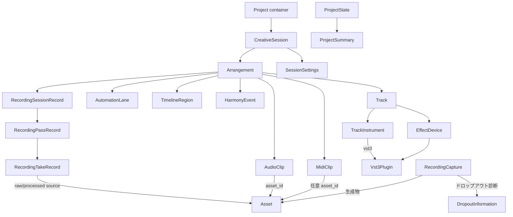

# Riffra データモデル

## 1. スコープ

本書はRiffraのドメインエンティティと、RustからTypeScript・C++へ渡す際の対応関係を示す。正準定義はRustに置き、各境界で必要な投影がどのモデルに由来するかを確認できるようにする。

### 書くこと

- エンティティのカタログと役割
- 各エンティティの3言語での定義場所（ファイルパス）
- 言語間対応の規則（serde・命名・欠落扱い・不透明データ）
- 守るべき不変条件と制約
- スキーマ進化の方針

### 書かないこと

- 各エンティティのフィールド全件・型の全列挙
- 各フィールドのJSONキー名
- 派生型・内部表現・実装詳細
- 個別のバリデーションロジック

詳細は各言語のコードを真実源とする。層構造の全体像は `architecture.md`、境界の契約は `ipc.md` を参照。

---

## 2. 型定義の場所

| エンティティ群                                  | 正準定義（Rust）                                                                | TypeScript                                            | C++ ミラー                                              |
| ----------------------------------------------- | ------------------------------------------------------------------------------- | ----------------------------------------------------- | ------------------------------------------------------- |
| セッション / アレンジ / クリップ / 録音レコード | `crates/riffra-core/src/domain/`                                                | `apps/desktop/src/model/generated/*.ts`（ts-rs 生成） | `native/audio-engine`（ランタイム投影に必要な部分のみ） |
| 素材（Asset / Provenance）                      | `crates/riffra-core/src/domain/asset/`                                          | 同上                                                  | —                                                       |
| エフェクト / VST3（EffectDevice / Vst3Plugin）  | `crates/riffra-core/src/domain/plugin/`                                         | 同上                                                  | `native/audio-engine`（グラフ構築）                     |
| 録音キャプチャ / ドロップアウト                 | `apps/desktop/src-tauri/src/recording/model.rs`                                 | 同上                                                  | `native/audio-engine`（録音制御）                       |
| 録音の read model                               | `apps/desktop/src-tauri/src/recording/repository.rs`（`RecordingAsset`）        | 同上                                                  | —                                                       |
| バックグラウンドジョブ                          | `apps/desktop/src-tauri/src/jobs.rs`                                            | 同上                                                  | —                                                       |
| オーディオ / デバイス状態                       | `apps/desktop/src-tauri/src/model.rs` ほか                                      | 同上                                                  | `native/audio-engine`                                   |
| Project container / 選択状態                    | `crates/riffra-host/src/project_store.rs`、`crates/riffra-runtime/src/model.rs` | 同上                                                  | —                                                       |

TypeScript は `npm run gen:types`（cargo test による ts-rs 出力 → `scripts/gen-barrel.js` のバレル生成）で常に Rust から再生成される。手書きの型は追加しない。

---

## 3. 言語間対応の規則

| 規則               | 内容                                                                                                                                                                  |
| ------------------ | --------------------------------------------------------------------------------------------------------------------------------------------------------------------- |
| serde 直列化       | `rename_all = "camelCase"`（enum は `"lowercase"`）                                                                                                                   |
| 不透明 ID 型       | `TimelineTick`・`Marker.tick` などは `#[ts(type = "number")]`。`AssetId` は `string & { readonly __brand: 'AssetId' }`（直列化はプレーン文字列 `<-> asset:<UUIDv7>`） |
| 省略可能フィールド | `skip_serializing_if = "Option::is_none"` + `#[ts(optional)]` を対で使用                                                                                              |
| 型の欠落           | ts-rs で生成できない型（`serde_json::Map` の `parameters` 等）は該当フィールドを `#[ts(skip)]` せず、生成側の扱いに従う                                               |
| C++ ミラー         | セッション全体はコピーしない。投影（グラフ・パラメータ・演奏・録音）に必要なスライスだけを別プロトコルで渡す（`ipc.md` のサイドカー契約）                             |
| 正当性の基準       | 永続化される正準表現は常に Rust の `CreativeSession`。TS は表示・編集のための投影、C++ は実行のための投影                                                             |

---

## 4. エンティティカタログ

### 4.1 Project container と Session

`ProjectId` はDataRootの `projects/<project-id>/` を識別するUUIDであり、`CreativeSession` のフィールドではない。`CreativeSession.session_id` は制作Session自身の識別子として保持し、Project packageをImportしても引き継ぐ。表示名は `CreativeSession.project_name` から得る。

`ProjectState` はActive ProjectのIDとProjectSummaryの一覧をまとめたUI・CLI向けの状態である。`ProjectSummary` はProject ID、表示名、更新時刻、読込エラーを持つ。読めないProjectも一覧から除外せず、エラーを表示できる。

`.riffra` はProjectのportable packageである。Importではpackageを検証して新しいProjectIdの
`projects/<project-id>/`へ取り込み、Exportではユーザーが指定した保存先へ書き出す。packageは
DataRoot内のcanonical Projectではなく、通常のProject切替にも使わない。

Render結果は音声書き出しの成果物であり、DataRootの `renders/` に保存する。Projectの正準状態や
`.riffra` packageを `renders/` に保存しない。

Sonalloy Bundle Format v1は`bundle.json`を入口とする。登録されたDemo、Pattern、Instrument、アセットを検証し、Demo名をProject名、各Partを定義順のInstrument Track、各PatternをTick 0から全長を保持するMIDI Clipへ変換する。Part IDはTrack名と変換時の対応キーに使い、Project・Track・Clip・Note・Deviceの内部IDはRiffraが生成する。音源Definition本文とアセットはProject専用Snapshotに所有させ、保存したProjectは元Bundleを参照しない。ファイル契約の定義は`crates/riffra-host/src/sonalloy_bundle.rs`に置く。

### 4.2 セッションと設定

| エンティティ      | 役割                                                                                                  |
| ----------------- | ----------------------------------------------------------------------------------------------------- |
| `CreativeSession` | 永続化される制作状態の単一の正準モデル                                                                |
| `SessionSettings` | マスターゲイン、ループ、カウントイン、メトロノーム、ノートとMixdown設定を保持するセッション全体の設定 |

### 4.3 アレンジ（時間軸）

| エンティティ                                                                                 | 役割                                                                                                                                                                                                                                                                                                                                                                                                                                                                                         |
| -------------------------------------------------------------------------------------------- | -------------------------------------------------------------------------------------------------------------------------------------------------------------------------------------------------------------------------------------------------------------------------------------------------------------------------------------------------------------------------------------------------------------------------------------------------------------------------------------------- |
| `TimelineTick`                                                                               | 時間軸の基本単位。`TIMELINE_PPQ = 960`：1拍を960分割                                                                                                                                                                                                                                                                                                                                                                                                                                         |
| `MusicalPosition` / `MusicalDuration` / `MusicalOffset` / `MusicalPitch` / `MusicalNoteName` | CLIやGUIなどの制作操作が使う音楽表現。小節・拍、全音符を1とする有理数、音名を表し、CoreでTimelineTickまたはMIDI pitchへ変換する。音名は入力した臨時記号の表記を保持し、double accidentalにも対応する。ノートの正準状態としては保存しない                                                                                                                                                                                                                                                     |
| `ProjectTimebase`                                                                            | 固定PPQとTick 0から始まるTempo・拍子変更点の列。ルーラー・スナップ・MIDI・Transport・録音・Renderが同じ区間変換を共有                                                                                                                                                                                                                                                                                                                                                                        |
| `FrameRange` / `FrameDuration`                                                               | ソース素材のフレーム範囲／持続時間（サンプルレートを併せ持つ）                                                                                                                                                                                                                                                                                                                                                                                                                               |
| `TimelineLoopRange` / `TimelinePunchRange`                                                   | ループ区間（無効化しても端点保持）とパンチ録音区間                                                                                                                                                                                                                                                                                                                                                                                                                                           |
| `Track`                                                                                      | Audio / Instrument の2種類。ゲイン・パン・Pan Law・ミュート・ソロ・アーム・モニタリング・物理入力・External Audioの入力元Track・Instrument・エフェクト列を保持                                                                                                                                                                                                                                                                                                                               |
| `AudioClip`                                                                                  | 非破壊オーディオクリップ。`asset_id` + `source_range` + `timeline_duration`、ゲイン・パン・フェード・ループ・ミュート。録音テイクへの関連（recording_take_id）と`take_variant`（raw/processed）を持つ                                                                                                                                                                                                                                                                                        |
| `MidiClip`                                                                                   | 非破壊 MIDI クリップ。`MidiNote`（ピアノロール編集対象）、`MidiEvent`（CC/ピッチベンド/チャンネルプレッシャー）と`InstrumentControlEvent`（高精度の音源制御）を持つ。すべてのノートとイベントはクリップの相対範囲内に収まり、ノートの `start_tick + duration_ticks` はクリップの `duration_ticks` 以下、MIDIイベントの位置はクリップ終端未満、音源制御イベントは終端を含む範囲に置ける。ノートとイベントはそれぞれ最大200,000件。`asset_id` は任意（セッション内で完結する MIDI は持たない） |
| `AudioClipPatch` / `MidiClipPatch`                                                           | 部分更新。None のフィールドは現値を維持                                                                                                                                                                                                                                                                                                                                                                                                                                                      |
| `AutomationLane` / `AutomationPoint`                                                         | トラックミックスパラメータ（volume / pan）のタイムライン制御データ                                                                                                                                                                                                                                                                                                                                                                                                                           |
| `Marker`                                                                                     | ルーラー表示用の名前付き位置情報（音声処理には影響しない）                                                                                                                                                                                                                                                                                                                                                                                                                                   |
| `TimelineRegion`                                                                             | セクション種別を持たない、自由な名前付き時間範囲。重複・入れ子・同名を許可し、音声処理やHarmonyなどの所有権は持たない                                                                                                                                                                                                                                                                                                                                                                        |
| `HarmonyChord`                                                                               | コード記号または明示音集合を解決した和声。name、任意のroot / bass、octaveを持たないtonesを保持し、third-party parserの型は公開しない                                                                                                                                                                                                                                                                                                                                                         |
| `HarmonyEvent`                                                                               | 和声コンテキストを表すArrangement全体の時間軸イベント。TimelineRegion、Track、MidiClipを所有せず、重複・入れ子・gapを許可する                                                                                                                                                                                                                                                                                                                                                                |
| `PhrasePattern` / `PhraseNote` / `PhrasePlacement`                                           | 半音差による相対フレーズと配置を表す操作値。複数placement・repeatへ展開した後は正準セッションへ保存しない                                                                                                                                                                                                                                                                                                                                                                                    |
| `RhythmPattern` / `RhythmStep`                                                               | Harmony realizationへ渡す反復リズム操作値。任意長、offset、duration、velocityを持ち、正準セッションへ保存しない                                                                                                                                                                                                                                                                                                                                                                              |
| `Arrangement`                                                                                | 上記のすべてを束ねるアレンジのルート。revision（編集のたびに単調増加）、timebase、tracks、clips、automation、markers、regions、harmony_events、録音レコード群を持つ                                                                                                                                                                                                                                                                                                                          |

音源制御イベントはSustain、Pitch Bend、Mod Wheel、Aftertouch、Parameter Changeを保持する。IDとClip相対Tickに加えて定義順を保存し、Parameter Changeは音源のパラメータIDとネイティブ値を正本にする。同音程が重なるNoteもそれぞれのIDでNote On/Offを対応させる。

External Audioは1つのSource TrackからInstrumentへ音声を渡す。複数Consumerを許可し、自身の参照と循環を拒否する。Sourceを削除すると接続を解除し、入力を必要とするConsumerの実行診断へ反映する。Pan Lawは通常のTrackで`equalPower`、中央Stereoを減衰させない場合に`unityCenterStereo`を選ぶ。

Mixdown設定は楽曲終端Tick、秒単位のTailとFade、任意のLoudness Mastering目標と比較用のSample Rate・Block Sizeを保持する。Entire Arrangementの終端は楽曲終端設定と現在のClip終端の大きい方にTailを加え、最終MixへFadeを1回適用する。

### 4.4 録音

| エンティティ             | 役割                                                                                                                                                                                                                            |
| ------------------------ | ------------------------------------------------------------------------------------------------------------------------------------------------------------------------------------------------------------------------------- |
| `RecordingSessionRecord` | 録音の試行グループ。track_slots（トラックごとのアクティブテイクとタイムラインクリップ）と pass_ids を持つ                                                                                                                       |
| `RecordingPassRecord`    | 録音範囲を1回通ったパス。ordinal、位置・長さ、部分開始/終了フラグ、そのパスのテイクID列                                                                                                                                         |
| `RecordingTakeRecord`    | 1パスが生んだトラック単位の成果物。`raw_audio` / `processed_audio`（`TakeAudioSource`：asset_id + サンプル範囲 + テール + サンプルレート）と`midi_asset_id`を持つ                                                               |
| `AudioTakeVariant`       | `raw` / `processed`。AudioClip がどちらの音源を使うか。片方が欠けていれば `preferred_audio_source` がフォールバック                                                                                                             |
| `RecordingCapture`       | 録音イベントそのもの（工程）。状態遷移 `recording → completing → completed \| recoverable \| failed` を唯一の遷移行列で定義。開始時点のセッション文脈（デバイス・マスター・アーム済みトラック）を保存。生成物は Asset ID で参照 |
| `DropoutInformation`     | 録音中のドロップアウト診断（書き込みサンプル数、欠落ブロック、欠落サンプル、ドロップアウト区間。raw/processed 別）                                                                                                              |
| `RecordingAsset`         | UI 用 read model。`recordings/inbox` のマニフェストから組み立て、回復（recoverable）時の表示・復旧操作を担う。永続ドメインとしては使用しない                                                                                    |

ディスク上の構成は `recordings/inbox|archive|library/<take>/`（manifest.json + raw/processed WAV + midi.json）。再生・編集に使うのはキャプチャから登録された正準 Asset であり、テイクディレクトリはリカバリ用の記録に留まる。

`AudioClip.take_variant` は、録音テイクの音源だけでなくトラックエフェクトの適用位置も表す。`raw` は現在の Track Effect Chain を通り、`processed` は録音時の Track Effect Chain が適用済みの音源としてその Chain を通らない。どちらの音源にも、クリップのゲイン・パン・フェードと、トラックのゲイン・パン・オートメーション、ミュート・ソロ、遅延補正を共通で適用する。

### 4.5 素材（Asset）

| エンティティ                         | 役割                                                                                                                                |
| ------------------------------------ | ----------------------------------------------------------------------------------------------------------------------------------- |
| `AssetId`                            | `asset:<UUIDv7>` のみ有効な、プロセス跨ぎで一意なID                                                                                 |
| `Asset`                              | 正準の制作素材。id、kind、コンテンツの場所（content_location）、作成・更新時刻、provenance、管理メタデータ（tag / note / favorite） |
| `AssetKind`                          | `audio` / `midi`                                                                                                                    |
| `Provenance` / `ProvenanceOperation` | 素材がどう生まれたか。operation（recorded / processed / rendered / imported）と source_asset_ids（消費した素材）、parameters        |
| 生成規則                             | `register`（新規IDを mint）と `derive`（source から派生物を mint）。コンテンツ変更は決して既存IDを上書きしない                      |

### 4.6 Instrument とエフェクト

| エンティティ                 | 役割                                                                                                                                       |
| ---------------------------- | ------------------------------------------------------------------------------------------------------------------------------------------ |
| `TrackInstrument`            | Instrument Trackに割り当てる音源。id、name、bypassed、実装sourceを持つ                                                                     |
| `TrackInstrumentSource`      | `internal`（同梱definition本文とBuilt-in preset ID）または `vst3`（`Vst3Plugin`）を表す判別付きsource                                      |
| `InternalInstrumentResource` | 同梱されたBuilt-in presetの識別子。definition本文も正準状態に保存し、resourceの絶対pathは保存しない                                        |
| `EffectDevice`               | Trackの信号チェーンに並ぶエフェクト。id、name、bypassed、`Vst3Plugin` を持つ。`Track.effects` の順に処理する                               |
| `Vst3Plugin`                 | VST3プラグインの永続状態。path、パラメータ値、プラグイン状態データ（不透明文字列）、欠落プラグインを無効化した状態（disabled_placeholder） |

`TrackInstrument`と`EffectDevice`は別に管理し、VST3の永続状態はどちらも`Vst3Plugin`で表す。Built-in音源とVST3音源は同じInstrument RuntimeからRealtimeとOffline Renderへ接続され、Built-in音源にはVST3 editorや外部plugin pathを割り当てない。

### 4.7 バックグラウンドジョブ

| エンティティ          | 役割                                                                                     |
| --------------------- | ---------------------------------------------------------------------------------------- |
| `JobKind`             | `scan`。ジョブの種別は結果ペイロードの型を固定する判別子                                 |
| `JobState`            | `queued → running → cancelling → cancelled \| completed \| failed`（終端からは戻らない） |
| `BackgroundJobStatus` | IPC 境界の typed view。kind がタグとなり result の形状を決定                             |

---

## 5. エンティティ関係

```mermaid
flowchart TD
    PC[Project container] --> CS[CreativeSession]
    PS[ProjectState] --> PM[ProjectSummary]
    CS --> AR[Arrangement]
    AR --> TR[Track]
    AR --> AC[AudioClip]
    AR --> MC[MidiClip]
    AR --> AU[AutomationLane]
    AR --> RG[TimelineRegion]
    AR --> HE[HarmonyEvent]
    AR --> RS[RecordingSessionRecord]
    RS --> RP[RecordingPassRecord]
    RP --> RT[RecordingTakeRecord]
    RT -->|raw/processed source| AS[Asset]
    AC -->|asset_id| AS
    MC -->|任意 asset_id| AS
    TR --> TI[TrackInstrument]
    TR --> ED[EffectDevice]
    TI -->|vst3| VP[Vst3Plugin]
    ED --> VP
    CS --> SE[SessionSettings]
    RC[RecordingCapture] -->|生成物| AS
    RC -->|ドロップアウト診断| DI[DropoutInformation]
```

- 素材（Asset）はセッションの外に正準で存在し、セッションは ID で参照する
- 録音レコード（Session/Pass/Take）はアレンジに永続化され、テイクの音源は Asset を指す
- 録音キャプチャは `recordings/` 配下の一時的な記録であり、完了時に Asset が正準となる

---

## 6. 不変条件と正準化

`validate_and_normalize`（`CreativeSession`）と `normalize_fields`（`AudioClip`）が守る規則。ロードと保存の両方の境界で適用される。

| 対象            | ルール                                                                                                                                                                                     |
| --------------- | ------------------------------------------------------------------------------------------------------------------------------------------------------------------------------------------ |
| session_id      | 空文字禁止。新規は `session-<ms>`                                                                                                                                                          |
| ProjectId       | `projects/` 直下のディレクトリ名としてcanonical lowercase UUIDを使う。`CreativeSession`へ埋め込まない                                                                                      |
| タイムベース    | `ppq` は常に `960`（`TIMELINE_PPQ`）。Tempo・拍子変更点はTick 0を必須とし、重複のない昇順。BPMは正の有限値。拍子の分母は `1/2/4/8/16/32`、分子は非ゼロ                                     |
| 音楽操作値      | `MusicalPosition` は1-originのbar/beatとbeat内の正規化分数、`MusicalDuration` は正の正規化分数、`MusicalPitch` は表記を保持したMIDI範囲内の音名。入力値はCoreで正準tick/pitchへ変換する    |
| TimelineRegion  | idとnameは空文字禁止、`end_tick > start_tick`。Region同士の重複・入れ子・同名を許可し、セクション種別を固定しない                                                                          |
| HarmonyEvent    | idはArrangement内で一意、和声名とtonesは空文字・空集合を禁止、`end_tick > start_tick`。最大16,384件で、イベント同士の重複・入れ子・gapを許可し、`start_tick`・`end_tick`・id順に正規化する |
| ゲイン          | マスター `-90.0..=0.0`、クリップ・トラック `-90.0..=24.0`。非有限値はエラー（マスター）または 0.0 へ正準化                                                                                 |
| パン            | `-1.0..=1.0`、非有限値は 0.0                                                                                                                                                               |
| フェード        | fade_in / fade_out はタイムライン持続時間以下にクランプ                                                                                                                                    |
| エフェクト      | idとnameは空文字禁止、id はTrack内で一意、1 Trackあたり最大256件                                                                                                                           |
| VST3 プラグイン | pathは空文字禁止。パラメータ値は `0.0..=1.0` にクランプし、非有限値は 0.0。状態データは4,000,000文字まで                                                                                   |
| カウントイン    | `0..=8` 拍                                                                                                                                                                                 |
| AssetId         | `asset:<UUIDv7>` のみ有効                                                                                                                                                                  |
| 素材コンテンツ  | 不変。内容変更は新しい Asset を mint する。変更可は管理メタデータのみ                                                                                                                      |
| 参照整合        | セッションが参照する AssetId は登録済みでなければならない（未登録参照は保存・ロード拒否、`architecture.md §6.4`）                                                                          |
| 録音遷移        | `RecordingCapture` は定義済み遷移行列のみ許可。終端状態からは戻れない                                                                                                                      |
| 更新時刻        | `updated_at_ms` はコミット時に単調増加し、保存世代やライブラリ表示の更新時刻として使う                                                                                                     |

---

## 7. スキーマ進化の方針

| 方針           | 内容                                                                                                                                                                             |
| -------------- | -------------------------------------------------------------------------------------------------------------------------------------------------------------------------------- |
| セッション文書 | `session.json`・世代ファイル・`.riffra` の `session.json` は `{"schemaVersion": 1, "session": {...}}` 形式。版を先に読み、現行の版（`SESSION_SCHEMA_VERSION`）以外は読み込まない |
| 現行スキーマ   | 永続化する型は未知のキーを拒否し、`Option` 以外のフィールドに既定値を持たない。欠けたキーや対応しない形のデータは正準状態へ取り込まない                                          |
| 世代回復       | 自動回復は読み込めない世代を飛ばし、手動復元も検証と正準化に成功した世代だけを正準状態へ取り込む                                                                                 |
| DataRoot       | `workspace.json` と `projects/` を中心とするProjectレイアウトを保持する                                                                                                          |
| 言語間の同期   | Rustを唯一の型定義元とする。TypeScriptは生成し、C++は投影プロトコルの検証テストで整合を保つ                                                                                      |
