# Riffra UI/UX設計

Riffraは、演奏しながら音を作り、録音や生成結果を素材として残し、その素材を音楽の中で試せる制作環境である。UIは個々の機能を並べるのではなく、音の流れと制作物の関係を一つの作業空間として表現する。

利用者は、どの画面でも次のことを理解できる。

1. どの制作領域で作業しているか
2. 何を選択しているか
3. 音がどこから入り、どの処理を通り、どこへ出ているか
4. 操作結果がどの素材として保存されるか
5. 次に行える主要な操作は何か

## 4. あるべき情報設計

### 4.1 制作の全体像

Play、Design、Arrangeは、同じSessionとLibraryを共有する三つの制作領域である。利用者は任意の領域から制作を始め、同じ素材を保ったまま領域を往復する。

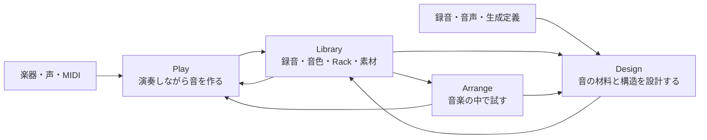

三領域の役割は次のとおりである。

| 制作領域 | 利用者の目的                 | 中心となる対象                            | 主な成果                             |
| -------- | ---------------------------- | ----------------------------------------- | ------------------------------------ |
| Play     | 演奏・歌唱しながら音を決める | Input、Rack、Plugin、Instrument           | Recording、Tone、Rack、Snapshot      |
| Design   | 音の材料と構造を作る         | Audio Asset、生成定義、Instrument Mapping | One Shot、Loop、Instrument、派生素材 |
| Arrange  | 複数の音を音楽として確かめる | Track、Audio Clip、MIDI Clip              | Sketch、Mix、WAV、Stem、MIDI         |

### 4.2 起動とSession

Riffraを起動すると、直前に使用していたSession、制作領域、選択対象、表示位置が開く。初回起動ではScratch Sessionが作成され、Playが開く。

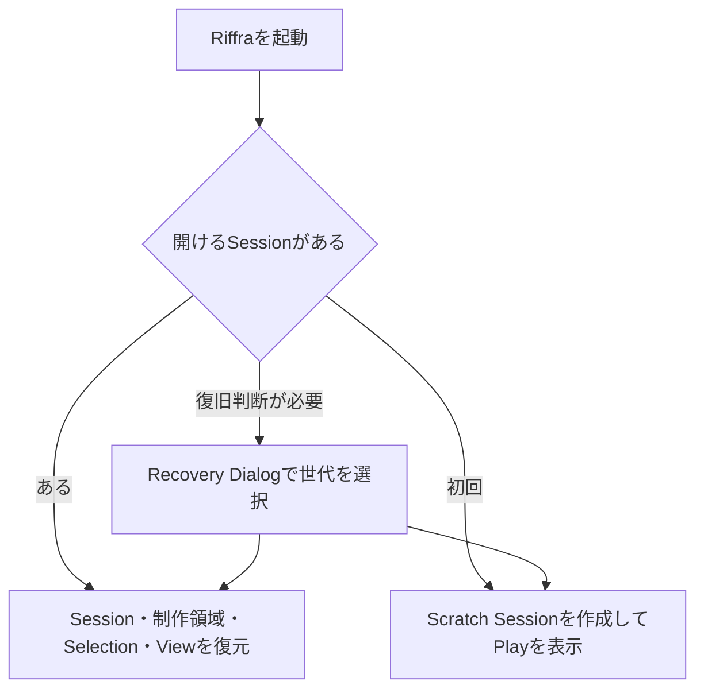

Sessionは、制作中の選択、Rack、録音、素材参照、時間軸、設定、履歴を共有する。Projectとして保存する前の着想もScratch Sessionに自動保存される。

Sessionの作成、Projectの読込み、保存、書出し、最近使ったSession、SettingsはSession Menuから扱う。

### 4.3 Session Shell

制作画面は、Global Bar、Browser、Main Workspace、Inspector、Transportで構成する。

```text
┌──────────────────────────── Global Bar ─────────────────────────────┐
│ Session ▾  ● Saved   ↶ ↷     Play  Design  Arrange     Audio ●  ■ │
├──────────────┬────────────────────────────────────┬─────────────────┤
│              │                                    │                 │
│   Browser    │          Main Workspace            │    Inspector    │
│              │                                    │                 │
│              │                                    │                 │
├──────────────┴────────────────────────────────────┴─────────────────┤
│                         Transport                                   │
└─────────────────────────────────────────────────────────────────────┘
```

| 領域           | 役割                                                |
| -------------- | --------------------------------------------------- |
| Global Bar     | Session、履歴、制作領域、検索、Audio状態、安全操作  |
| Browser        | LibraryとPlugin Catalogを検索し、制作領域へ投入する |
| Main Workspace | Play、Design、Arrange固有の制作操作を行う           |
| Inspector      | 選択対象の状態、設定、由来、使用先を表示・編集する  |
| Transport      | 現在の再生対象を再生、停止、録音、試聴する          |

BrowserとInspectorは開閉できる。閉じても検索条件、選択対象、編集中の値は保持される。Main Workspaceは利用可能な幅を使い、演奏、編集、時間軸を中心に表示する。

### 4.4 LibraryとBrowser

Libraryは、種類を問わず制作物を検索し、由来と関連を辿る索引である。Browserは、LibraryとPlugin Catalogを操作する左サイドパネルである。

```text
Library
├─ Recording
├─ Audio Asset
├─ Instrument
├─ Rack / Tone / Snapshot
├─ MIDI
├─ Project / Export
└─ Inbox

Plugin Catalog
└─ VST3

Browser
└─ LibraryとPlugin Catalogを横断検索して制作領域へ投入する
```

Browserには、利用可能な種類と実データを表示する。検索結果は名前だけでなく、種類、状態、由来、保存先を識別できる形で表示する。

Browserで選択した対象は、制作領域に応じたPrimary Actionを持つ。

| 選択対象    | Play                       | Design                | Arrange                |
| ----------- | -------------------------- | --------------------- | ---------------------- |
| Plugin      | Rackへ追加                 | Source処理に使用      | Track Rackへ追加       |
| Recording   | Referenceとして使用        | Sourceとして開く      | Timelineへ配置         |
| Audio Asset | RackまたはInstrumentで試す | 編集・加工する        | Timelineへ配置         |
| Instrument  | MIDIで演奏する             | Mappingを編集する     | MIDI Trackへ割り当てる |
| Rack / Tone | Rackへ読み込む             | 処理に使用する        | Trackへ読み込む        |
| MIDI        | Instrumentへ送る           | Mapping確認に使用する | Timelineへ配置         |

Primary ActionとDrag & Dropは同じ結果を生む。投入先が複数ある場合は、実行前に対象のRack、Track、Padなどを選択できる。

### 4.5 SelectionとInspector

Browser、Rack、Design Canvas、Timelineで選択した対象は、一つの共通Selectionとして扱う。

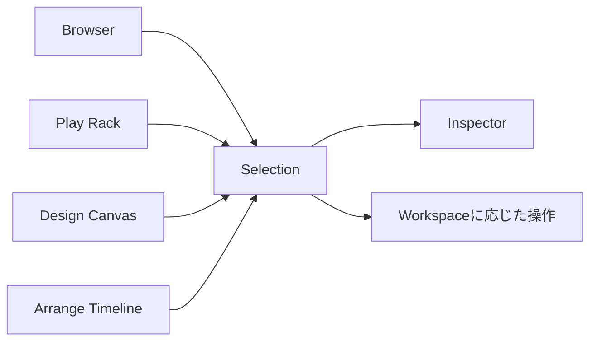

選択できる主な対象:

- Input / Output Device
- Rack / Plugin / Internal Processor
- Recording / Audio Asset / Generated Definition
- Instrument / Pad / Key Mapping
- Track / Audio Clip / MIDI Clip / MIDI Note
- Snapshot / Job / Missing Dependency

制作領域を切り替えてもSelectionは保持される。Inspectorは選択対象に応じて内容を切り替え、同じ対象が別の制作領域でどのように利用されるかを示す。

### 4.6 状態の見せ方

UIは、操作対象の状態と次の行動を一貫した形式で示す。

| 状態             | 表示する内容                                        |
| ---------------- | --------------------------------------------------- |
| Empty            | 対象がない理由と、最初に行う操作                    |
| Ready            | 現在の実効値と主要操作                              |
| Working          | 処理対象、進捗、Cancel                              |
| Muted / Bypassed | 対象、理由、解除操作                                |
| Recoverable      | 守られたデータ、影響範囲、復旧操作                  |
| Failed           | 失敗した処理、利用可能なデータ、Retryまたは回避操作 |

Meter、Device、Plugin、Asset、再生位置、時間は、現在のSessionとAudio Engineが持つ値を表示する。Buttonは実行できる操作を表し、実行できない場合は無効である理由を確認できる。

### 4.7 複雑さの段階

基本操作、制作編集、詳細設定を同じ画面上で段階的に開ける。

| 段階     | 内容                                                                                       |
| -------- | ------------------------------------------------------------------------------------------ |
| Basic    | Input / Output、Plugin追加、Mute、Record、Preview、Timeline配置                            |
| Edit     | Parameter、Macro、Snapshot、Clip、Pad、Track、Reference、Render                            |
| Advanced | Driver、Sample Rate、Buffer、Channel Routing、生成Graph、Provenance、Diagnostics、Recovery |

初めて使う利用者はBasic操作だけで演奏、録音、配置まで進める。制作内容を深く調整する利用者は、同じ対象を選択したままEditとAdvancedへ進める。

## 5. 各領域の完成像

### 5.1 Global Bar

Global Barは、Session全体に関わる状態と安全操作を常に表示する。

```text
┌──────────────────────────────────────────────────────────────────────┐
│ R  Session ▾  ● Saved   ↶ ↷   Play  Design  Arrange   ⌕   Audio ●  ■ │
└──────────────────────────────────────────────────────────────────────┘
```

| 領域      | 内容                                                      |
| --------- | --------------------------------------------------------- |
| Session   | 名称、保存状態、New、Open、Save、Export、Recent、Settings |
| History   | Undo / Redo                                               |
| Workspace | Play / Design / Arrange                                   |
| Search    | CommandとAsset検索                                        |
| Audio     | Device、状態、Latency、設定、Recover                      |
| Safety    | Emergency Mute                                            |

Audio Statusを開くと、演奏に必要な入出力とLatencyを確認できる。

```text
Audio ● Ready
Input    AXE I/O · Input 1
Output   AXE I/O · Output 1/2
Latency  7.4 ms
[Audio Settings] [Recover Device]
```

Audio SettingsではDriver、Sample Rate、Buffer、Channel Routingを扱う。設定変更時は安全にMuteし、適用された実効値を表示する。

### 5.2 Play

Playは、入力された音を聞きながら、演奏に使う音を決める場所である。Main Workspaceには実際のSignal Flowを表示する。

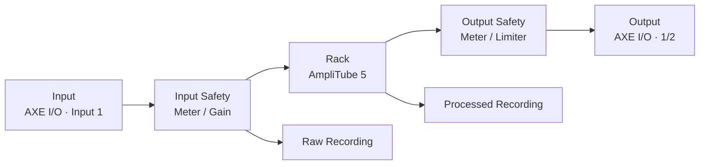

```text
┌ Browser ────┬──────────────────── Play ────────────────────┬ Inspector ──┐
│ Search      │ Input          Rack                 Output    │ AmpliTube 5 │
│             │ ┌────────┐  ┌──────────────┐     ┌────────┐  │ Active      │
│ Plugins     │ │ IN 1   │→ │ AmpliTube 5  │ →   │ OUT 1/2│  │ Preset      │
│ AmpliTube 5 │ │ Meter  │  │ Open  Bypass │     │ Meter  │  │ Macros      │
│             │ └────────┘  └──────────────┘     └────────┘  │ Parameters  │
│ Racks       │                [+ Add Device]                  │ Routing     │
│             │                                                │             │
│ Inbox       │ Snapshot  A  B      Recorder: Raw + Processed │             │
├─────────────┴────────────────────────────────────────────────┴─────────────┤
│ Live Input · Monitoring   ▶/■   ● Record   IN ▰▰  OUT ▰▰   Master -18 dB │
└─────────────────────────────────────────────────────────────────────────────┘
```

Playで行う主な操作:

- Input DeviceとChannelを選択する
- Input MeterとGainを確認する
- Pluginと内部処理をRackへ追加し、順序を変更する
- VST3 Editorを開き、演奏しながら音を調整する
- Bypass、Mute、Gain、Pan、Macroを操作する
- ToneとRackをSnapshotとして比較・保存する
- Raw、Processed、MIDI、録音条件を一つのRecordingとして保存する

Rackは、Audio Engineで有効なDeviceを処理順に表示する。Plugin CatalogはBrowserに表示し、Rackへ追加するとSignal Flowに現れる。

VST3 EditorはPluginが提供する実画面をNative Windowで表示する。Editorを閉じてもRackの音声処理は継続する。

### 5.3 Design

Designは、音の材料と構造を設計し、再利用できる音源へ仕上げる場所である。選択したSource、使用するTool、生成されるResultを同じ画面に表示する。

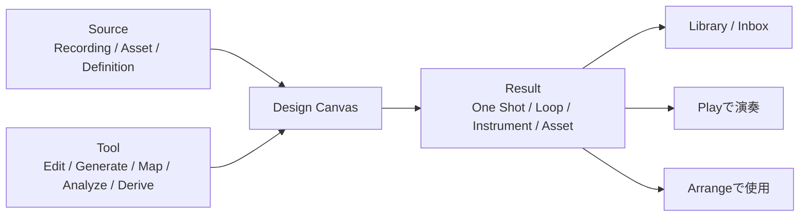

```text
┌ Browser ───┬──────────────────── Design ───────────────────┬ Inspector ──┐
│ Search     │ Source: Raw DI 07                              │ Raw DI 07   │
│            ├──────── Tool Rail ────────────────────────────┤ Source      │
│ Recordings │ Edit  Generate  Map  Analyze  Derive          │ Range       │
│ Raw DI 07  ├───────────────────────────────────────────────┤ Loop        │
│            │                                               │ Gain        │
│ Samples    │              Design Canvas                    │ Provenance  │
│ Racks      │        Waveform / Graph / Mapping             │ Used by     │
│            │                                               │             │
│ Inbox      ├───────────────────────────────────────────────┤             │
│            │ Result: Guitar Loop 01  [Save] [Play] [Place]│             │
├────────────┴───────────────────────────────────────────────┴─────────────┤
│ Selected Asset · Preview   ◀  ▶/■  Loop   00:03.24 / 00:08.00          │
└───────────────────────────────────────────────────────────────────────────┘
```

Design Tool:

| Tool     | 内容                                                |
| -------- | --------------------------------------------------- |
| Edit     | Range、Fade、Loop、Pitch、Length、Gain、Layer       |
| Generate | 数式、基本波形、Noise、Envelope、Modulation、Filter |
| Map      | Pad、Keyboard、Key Range、Velocity                  |
| Analyze  | Waveform、Level、Spectrum、Phase、Reference Compare |
| Derive   | Separation、Resample、Rack処理、派生素材            |

Sourceに適用できるToolが有効になり、適用条件を満たさないToolには必要なSource条件を表示する。編集中の定義に問題がある場合は、直前の有効な音を保ち、問題箇所と修正方法を示す。

AI支援は、選択中のSource、Tool、Resultに対する説明、候補、ChangeSetとしてInspectorに表示する。処理内容が明確な機能は、`Reference Match`のように処理そのものを表す名称を使用する。

### 5.4 Arrange

Arrangeは、PlayとDesignで作った音を時間軸へ置き、音楽の中で使えるかを確認する場所である。Track Header、Timeline Lane、Clip、再生位置を一つの座標系で表示する。

```text
┌ Browser ───┬────────────────── Arrange ────────────────────┬ Inspector ──┐
│ Search     │        0s        5s        10s        15s     │ Take 02     │
│            │        │         │          │          │      │ Start       │
│ Recordings │ Guitar │ [Take 01────] [Take 02────────]      │ Length      │
│ Take 01    │ Sample │      [Hit]       [Loop────────]      │ Gain        │
│ Take 02    │ MIDI   │ [Chord Progression────────────]      │ Fade        │
│            │                                               │ Pan         │
│ Samples    │                                               │ Track       │
│ MIDI       │                                               │ Provenance  │
│ Inbox      │                                               │             │
├────────────┴───────────────────────────────────────────────┴─────────────┤
│ Timeline  001.01.000   ◀  ▶  ■  ●   120 BPM  4/4  Loop   Master -6 dB │
└───────────────────────────────────────────────────────────────────────────┘
```

Timeline上で行う主な操作:

- Trackの追加、並替え、Group、Return、Routing
- Audio ClipとMIDI Clipの配置
- Clipの選択、複数選択、移動、複製、分割
- Clip端の操作によるSource範囲と長さの変更
- Loop、Fade、Gain、Pan、Mute、Solo
- Timeline Zoom、Scroll、再生位置、Loop範囲
- Tempo、拍子、Marker、基本的なAutomation
- Master、Track、Stem、MIDIの書出し

Inspectorでは、Position、Length、Source In / Out、Gain、Pan、Fadeなどを数値で精密編集できる。Timeline上の操作とInspectorの値は常に一致する。

MIDI Clipを開くとPiano Rollが表示され、Noteの選択、移動、長さ、Velocity、Channelを直接編集できる。

### 5.5 Browser

Browserは左サイドパネルにあり、すべての制作領域で共通利用する。

```text
┌ Browser ─────────────────────┐
│ Search assets and plugins…   │
│ All  Audio  Instruments      │
│ Racks  MIDI  Plugins         │
├──────────────────────────────┤
│ Raw DI 07        Recording   │
│ Guitar Loop 01   Loop        │
│ Night Practice   Rack        │
│ AmpliTube 5      Plugin      │
├──────────────────────────────┤
│ Inbox · 3                    │
└──────────────────────────────┘
```

Browserは次を満たす。

- 名前、種類、Tag、Note、由来を横断検索できる
- 検索語、Filter、選択を制作領域間で保持する
- Workspaceに応じたPrimary Actionを表示する
- Drag & Dropの投入先を視覚的に示す
- Inboxの未整理、処理中、復旧可能、失敗を区別する
- 選択したAssetの関連素材と使用先をInspectorで辿れる

### 5.6 Inspector

Inspectorは右サイドパネルにあり、共通Selectionの詳細と編集を担当する。

```text
┌ Inspector ─────────────────┐
│ Identity                   │
│ Name / Kind / State        │
├────────────────────────────┤
│ Primary Properties         │
├────────────────────────────┤
│ Routing / Usage            │
├────────────────────────────┤
│ Provenance                 │
├────────────────────────────┤
│ Safety / Missing           │
├────────────────────────────┤
│ Advanced ▸                 │
└────────────────────────────┘
```

Inspectorの共通構造:

1. Identity — 名前、種類、状態
2. Primary Properties — 主要な編集値
3. Routing / Usage — 入出力、割当、使用先
4. Provenance — 元素材、処理、派生素材
5. Safety / Missing — 欠損、保護、復旧
6. Advanced — 詳細値と診断情報

選択対象がない場合はSession概要を表示する。中央Workspaceで直接操作すると、Inspectorはその対象と値を即時に反映する。

### 5.7 Transport

Transportは画面下部にあり、現在の再生対象を明示して操作する。

| 制作領域 | 再生対象                    | 主な操作                                              |
| -------- | --------------------------- | ----------------------------------------------------- |
| Play     | Live Input / Rack           | Monitoring、Record、Meter、Mute、Master               |
| Design   | Selected Asset / Instrument | Preview、Stop、Loop、Preview Position                 |
| Arrange  | Timeline                    | Position、Play、Stop、Record、Tempo、拍子、Loop Range |

```text
Play     Live Input · AXE I/O → AmpliTube 5
Design   Selected Asset · Guitar Loop 01
Arrange  Timeline · Untitled Scratch
```

再生対象に必要な操作と値だけを表示する。録音中、Preview中、Timeline再生中、Muted、Faultedを明確に区別する。

### 5.8 Session MenuとRecovery

Session Menuは、SessionとProjectに関する操作をまとめる。

```text
Session ▾
├─ New Scratch Session
├─ Open Project…
├─ Recent Sessions
├─ Save as Project…
├─ Export Package…
├─ Close Session
└─ Settings…
```

Recovery Dialogは、開く世代を利用者が選ぶ必要があるときに表示する。

```text
┌ Session Recovery ──────────────────────────┐
│ 復旧可能なSessionがあります。                │
│                                            │
│ ● 10:42  Untitled Scratch  正常             │
│ ○ 10:39  Untitled Scratch  録音中断あり      │
│                                            │
│ 保存済み: Session、Raw、Processed、MIDI      │
│ [選択した世代を開く]  [新しいScratchを開く]   │
└────────────────────────────────────────────┘
```

復旧後は、選択したSessionの制作領域とSelectionを表示する。

## 6. 主要ユーザーフロー

### 6.1 起動して制作を続ける

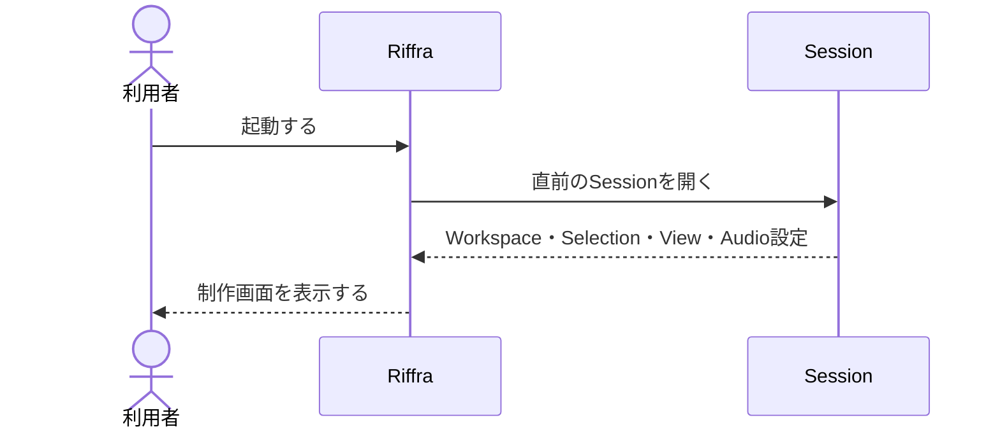

完了状態:

- 直前のPlay、Design、Arrangeが開く
- Selection、Browser、Inspector、Transportの文脈が復元される
- Sessionの保存状態とAudio状態が分かる
- 復旧判断が必要な場合はRecovery Dialogで世代を選べる

### 6.2 ギターをAmpliTubeで鳴らす

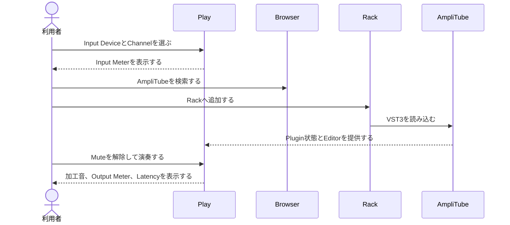

完了状態:

- Input Meterがギター入力へ反応する
- AmpliTubeがRackのSignal Flowに表示される
- VST3 Editorを開いて音を変更できる
- Bypass、Remove、Parameter変更が実音へ反映される
- Input、Rack、Outputの状態を個別に確認できる
- 演奏可能なLatencyとSafety状態が分かる

Pluginの読込みに失敗した場合は、対象と理由を表示し、Retry、Bypass、Removeを選べる。SessionとRackの保存済み状態は保持される。

### 6.3 演奏を録音する

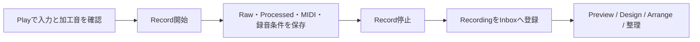

完了状態:

- 録音中であることと経過をTransportで確認できる
- Raw、Processed、MIDIの保存状態が分かる
- 停止後にRecordingがInboxへ現れる
- Recordingの名称、Tag、Noteを編集できる
- RecordingをDesignまたはArrangeへ送れる
- 中断時も取得済みデータと復旧操作を確認できる

### 6.4 Recordingから音源を作る

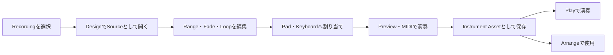

完了状態:

- SourceとResultを同時に確認できる
- 元Recordingは保持される
- 編集内容と生成Assetの関係をInspectorで辿れる
- 保存前にPreviewとMIDI演奏ができる
- InstrumentをLibraryから再利用できる

### 6.5 数式から音源を作る

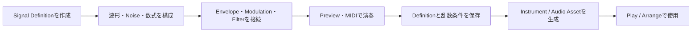

完了状態:

- 生成構造とParameterを編集できる
- 無効な定義の問題箇所と修正方法が分かる
- 危険な出力と計算量が制限される
- 同じ定義と条件から同じ音を再現できる
- Definition、生成音、使用先をLibraryで辿れる

### 6.6 音を組み合わせて書き出す

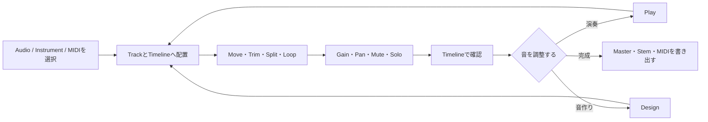

完了状態:

- AudioとMIDIをTrackへ配置できる
- Track、Clip、時間、再生位置の関係が分かる
- Timeline上で主要編集を直接行える
- PlayとDesignで作り直した素材へ差し替えられる
- Master、Track、Stem、MIDIの書出し結果がLibraryに残る

### 6.7 障害から復旧する


完了状態:

- 危険な音声出力が停止する
- 保全されたSession、Recording、Assetが分かる
- 問題の対象と影響範囲が分かる
- 状況に合った復旧操作を選べる
- 復旧後も制作領域とSelectionが維持される

### 6.8 制作体験の共通条件

- Play、Design、Arrangeを切り替えてもSession、Selection、再生、録音、Mute、素材参照を失わない
- Browserの選択対象とMain Workspace、Inspectorの表示が一致する
- Primary ActionとDrag & Dropが同じ制作結果を生む
- Empty、Ready、Working、Muted、Recoverable、Failedを区別できる
- 主要操作をKeyboardから実行できる
- Basic操作だけで演奏、録音、配置まで進める
- EditとAdvancedへ、選択対象を保ったまま進める
- すべての表示値がSession、Library、Audio Engineの状態と一致する
